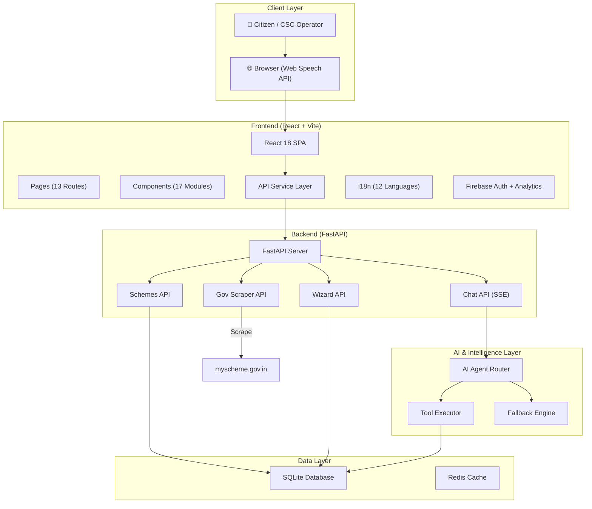
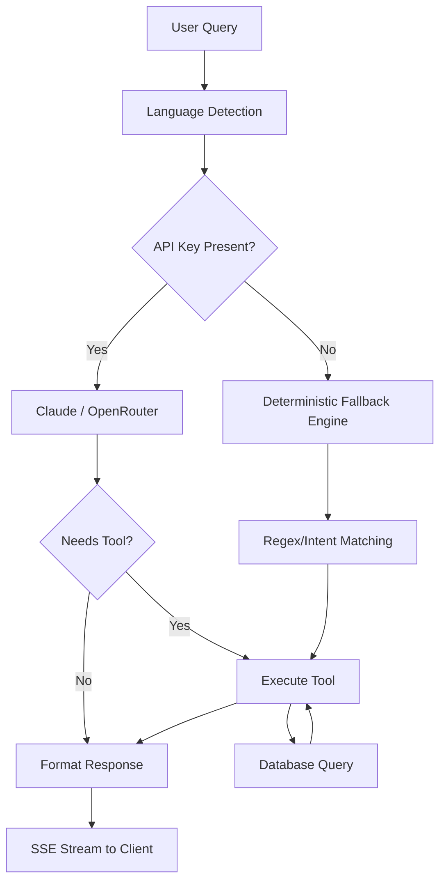

# Architecture

SETU is built on a modern, decoupled architecture designed for scalability, low latency, and high availability.

## High-Level Architecture

## Frontend Architecture
The frontend is a React 18 Single Page Application built with Vite and TypeScript.
- **State Management**: React Hooks (useState, useEffect, useContext).
- **Styling**: Tailwind CSS for responsive, utility-first styling.
- **Routing**: `react-router-dom` with 13 distinct routes.
- **Internationalization**: `react-i18next` handling 12 Indian languages.
- **Voice**: Native browser Web Speech API for voice-to-text.

## Backend Architecture
The backend is a FastAPI Python application.
- **Asynchronous**: Built on ASGI (Uvicorn) for high concurrency.
- **Streaming**: Server-Sent Events (SSE) used for real-time AI chat streaming.
- **Scraping**: `BeautifulSoup4` and `lxml` for real-time data extraction from government portals.
- **ORM**: SQLAlchemy 2.0 interacting with a SQLite database (PostgreSQL compatible).

## AI Architecture
SETU uses a sophisticated tool-calling AI architecture.

