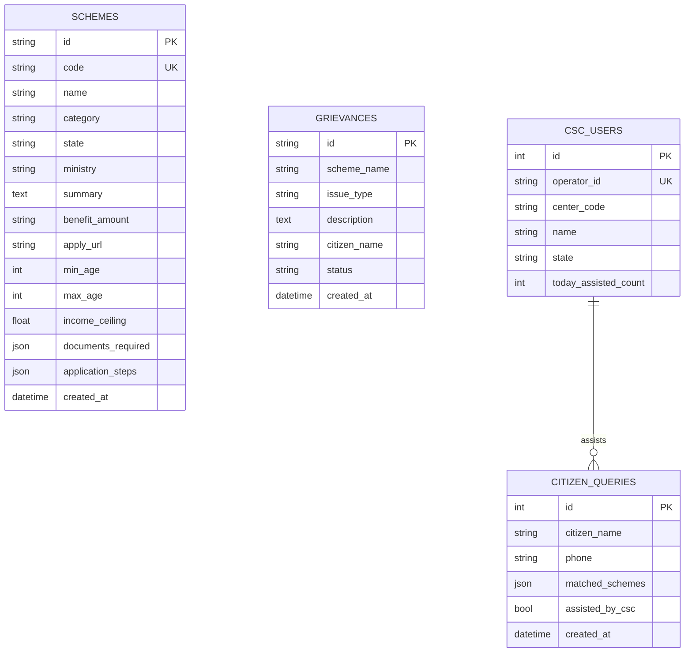

# Database Design

SETU uses SQLite out-of-the-box via SQLAlchemy 2.0, making it fully PostgreSQL compatible for production deployment.

## Entity Relationship Diagram

## Tables

### 1. Schemes Table
Stores curated scheme data with detailed eligibility criteria (age, gender, state, income, BPL status) used by the AI tool and Wizard for deterministic matching.

### 2. Grievances Table
Stores citizen complaints (e.g., payment not received, application rejected) generated via the AI chat interface.

### 3. CSC_Users Table
Stores Village Level Entrepreneur (VLE) profiles for the CSC dashboard.

### 4. Citizen_Queries Table
Logs intake sessions performed by CSC operators on behalf of citizens, including the matched schemes for auditing.
