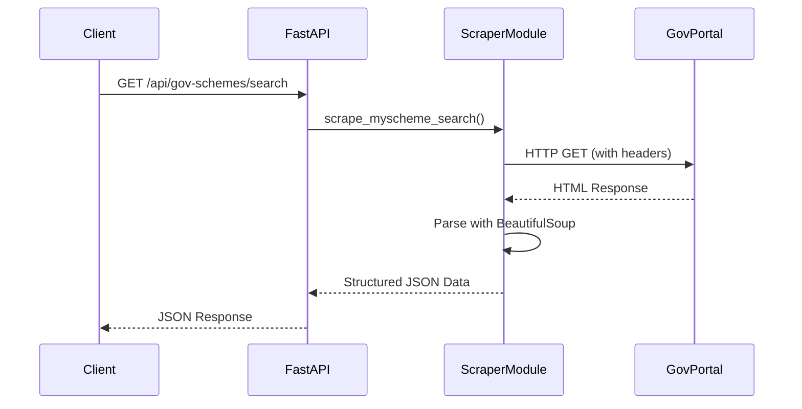
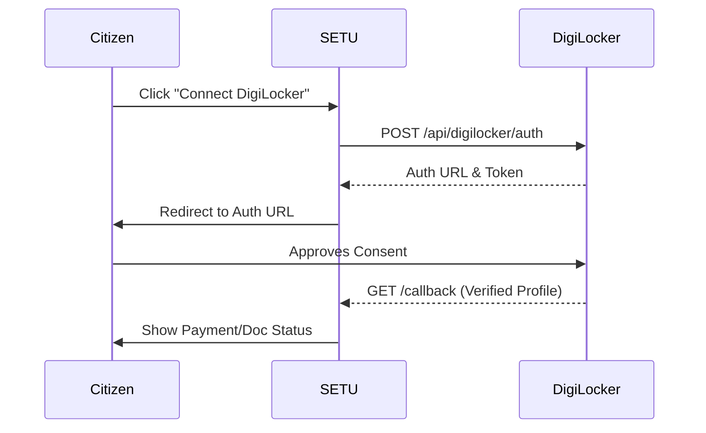

# System Design

## Core Systems

### 1. Conversational AI System
The chat system uses Server-Sent Events (SSE) to stream responses chunk-by-chunk to the frontend, providing a low-latency, ChatGPT-like experience. 

- **Tool Calling**: The AI has access to 6 distinct tools:
  - `search_schemes`: Queries the DB with demographic filters.
  - `get_scheme_details`: Fetches full schema data.
  - `check_eligibility`: Runs rule-based checks against user profiles.
  - `check_payment_status`: Simulates DBT checks.
  - `get_required_documents`: Returns checklists.
  - `file_grievance`: Generates grievance tickets.

### 2. Live Web Scraping System
To ensure data freshness, SETU implements a live scraping module.

### 3. Eligibility Wizard System
A multi-step scoring engine that ranks schemes based on user profiles.

- **Base Score**: 65
- **State Match**: +15 (or -40 if mismatch)
- **Income/Age Match**: +10 (or disqualification if unmet)
- **BPL/Disability Match**: +15 to +25

### 4. DigiLocker OAuth Simulation
A simulated OAuth 2.0 flow for document verification.

## Security & Compliance
- **API Keys**: Excluded from version control via `.gitignore`.
- **GIGW Compliance**: The UI includes an Accessibility Bar for contrast and font scaling.
- **Zero-Emoji Policy**: Uses strictly SVG icons (Lucide) for professional government compliance.
